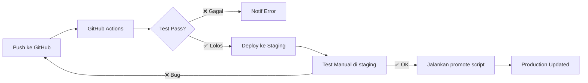

# CI/CD Setup untuk e-SCM

## Konsep

```
Push ke GitHub → GitHub Actions (test otomatis) → Deploy ke Staging → Test Manual → Promote ke Production
```

## Arsitektur di VPS

```
scm-checklist.seriusmen.online      → Nginx → port 3001 → e-scm-prod (PM2)  ← PRODUCTION
scm-staging.seriusmen.online        → Nginx → port 3002 → e-scm-staging (PM2) ← STAGING
```

- **Staging**: Auto-deploy setiap push ke branch `main`
- **Production**: Deploy manual setelah staging lolos test

## Yang Akan Dibuat

### 1. GitHub Actions CI/CD Pipeline
File: `.github/workflows/deploy.yml`
- ✅ Install dependencies
- ✅ Build frontend (vite build)
- ✅ Test: pastikan server bisa start & health check OK
- ✅ Auto-deploy ke **Staging** via SSH
- ❌ Tidak langsung ke Production (butuh approval manual)

### 2. Deploy Script di VPS
File: `/var/www/e-scm-deploy.sh`
- Pull code terbaru
- Install dependencies
- Build jika perlu
- Restart PM2 (staging atau production)
- Health check otomatis
- Rollback otomatis jika gagal

### 3. Promote Script (Staging → Production)
File: `/var/www/e-scm-promote.sh`
- Copy code dari staging ke production
- Restart PM2 production
- Health check
- Rollback jika gagal

### 4. Struktur Folder VPS

```
/var/www/
├── e-scm-staging/     ← auto-deploy dari GitHub (port 3002)
├── e-scm/             ← PRODUCTION (port 3001) - yang sudah ada
├── santo/             ← Inventori app (port 3000) - TIDAK DISENTUH
```

## Flow Kerja



## Perlu Disiapkan

> [!IMPORTANT]
> 1. **SSH Key** — GitHub perlu akses SSH ke VPS untuk auto-deploy
> 2. **DNS record** — Tambah subdomain `scm-staging.seriusmen.online` → `103.126.117.112`
> 3. **Nginx config** — Tambah config untuk staging (port 3002)

## Apakah mau saya lanjut buat semua file ini?
